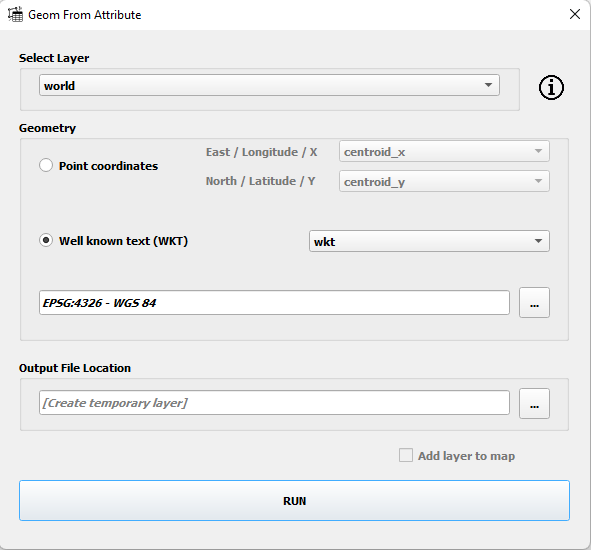

# QGIS Geom From Attribute

This plugin allows users to create geometry using attributes from tables. It creates GPKG, SHP, KML, GML or GEOJSON file from QGIS compatible table based layers. There are two options to create geometry. First one is using columns, that contain X(longitude) and Y(latitude) values of Points. This method can be used only for Points. Other option is using single column, that contains Well Known Text(WKT) values of geometry. This method is used for Points, MultiPoints, Lines, MultiLines, Polygons and MultiPolygons.

If input table contains WKT values for multiple geometry types (such as Polygon, Point, Line etc.) each type is saved seperately.

 
 

<table style="border-collapse: collapse;border: none;">
  <tr style="border: none;">
    <td style="border: none;"></td>
    <td style="border: none;">
      1-) Download the example data - <a href="./sample_data"/>Download<a> 
      2-) Select the layer 
      3-) Select the method (WKT or Point Coordinates) 
      4-) Select SRS  
      5-) Select output path or leave blank to create temporary data 
    </td>
  </tr>
</table>

